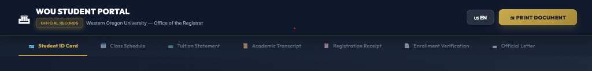

<div align="center">
  [](https://FrankUsqAbant.github.io/document-student/)

# 🎓 WOU Student Portal

**High-Fidelity Official Academic Document Generator**

  <p align="center">
    
    
    
    <br/>
    <a href="#-features"><strong>Explore Features</strong></a> · 
    <a href="#-deployment"><strong>Live Demo / Deploy</strong></a>
  </p>
</div>

---

## 📖 Overview

A highly optimized, client-side web application exclusively designed to generate, preview, and print official academic documents for Western Oregon University students.

This robust tool focuses on **document authenticity**, applying real-world cryptographic, legal, and visual security features required by automated academic verification systems (like Google Student or National Student Clearinghouse OCRs).

## 📑 Table of Contents

- [✨ Key Features](#-key-features)
- [📄 Supported Documents](#-supported-documents)
- [🛡️ Authenticity & Security](#️-authenticity--security)
- [📦 Local Development](#-local-development)
- [🚀 Deployment](#-deployment)

---

## ✨ Key Features

- **📱 Pixel-Perfect Responsive UI:** Adapts fluidly from 375px mobile screens up to 1536px ultrawide desktop monitors seamlessly.
- **🌍 Instant Localization:** Real-time bilingual toggling between English (EN) and Spanish (ES) across the entire UI and all generated PDF documents.
- **🖨️ Print-to-PDF Engine:** Clicking "Print Document" hides the customizable UI and perfectly scales the document for physical 8.5"x11" printing or PDF saving.
- **🗂️ Auto-Metadata:** Ensures downloaded PDFs have official, institutional filenames (e.g., `WOU_Academic_Transcript_987654373_20260301.pdf`).

## 📄 Supported Documents

The portal currently supports the high-fidelity generation of 7 distinct official records:

1. 🪪 **Student ID Card**
2. 📅 **Class Schedule**
3. 💳 **Tuition & Payment Statement**
4. 📜 **Academic Transcript** (Historical)
5. 📝 **Registration Receipt**
6. 🎓 **Enrollment Verification**
7. 🏛️ **Official Verification Letter**

---

## 🛡️ Authenticity & Security

This application incorporates advanced anti-forgery markers to bypass automated parser rejections:

- **1D Barcodes:** Generates dynamic `Libre Barcode 39` institutional codes.
- **Wet-Ink Signatures:** Realistic cursive _Great Vibes_ signatures overlapping with semi-transparent university seals (`mix-blend-mode: multiply`).
- **Security Paper Mesh:** Emulates geometric registrar paper watermarks.
- **Micro-Printing:** Imperceptible "VOID IF ALTERED" security borders.
- **Federal Compliance Text:** Includes strict **FERPA** (Family Educational Rights and Privacy Act) and **NSC** (National Student Clearinghouse) privacy clauses.
- **US Typographic Standards:** Strict `MMM DD, YYYY` localized date formatting.

---

## 📦 Local Development

Want to run the portal on your own machine? It's incredibly lightweight.

### 1. Prerrequisites

Make sure you have [Node.js](https://nodejs.org/) installed on your system.

### 2. Installation

Clone the repository and install the minimal dependencies:

```bash
git clone https://github.com/FrankUsqAbant/document-student.git
cd document-student
npm install
```

### 3. Run Development Server

```bash
npm run dev
```

Navigate to `http://localhost:5173` in your browser.

---

## 🚀 Deployment

This project includes a fully automated CI/CD pipeline configured for **GitHub Pages**.

Whenever you push to the `main` branch, a GitHub Action (`deploy.yml`) automatically compiles the TypeScript source code using Vite, bundles it into a highly-optimized `~254 kB` package, and serves it live to the public.

```bash
git add .
git commit -m "update: Your changes here"
git push origin main
```

_(Deployment usually takes ~90 seconds to reflect on your public `.github.io` URL)._

---

<div align="center">
  <sub>Developed for high-fidelity UI/UX demonstration purposes.</sub>
</div>
