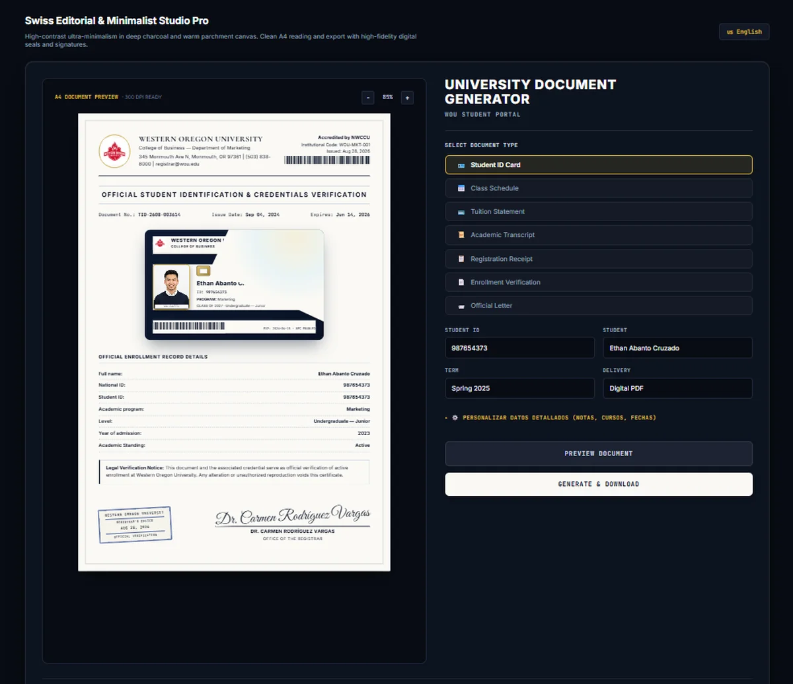

<div align="center">

<br>

# 🏛️ &nbsp; W O U &nbsp; A C A D E M I C &nbsp; D O C U M E N T &nbsp; S T U D I O

**Generador de Documentos Académicos Oficiales · Western Oregon University**

<br>

<a href="https://frankusqabant.github.io/document-student/">
  
</a>

<br>
<br>

[](https://react.dev/)
[](https://www.typescriptlang.org/)
[](https://vitejs.dev/)
[](./LICENSE)
[](https://frankusqabant.github.io/document-student/)
[](https://github.com/FrankUsqAbant/document-student)

<br>

### 🌐 **[Probar Demo en Vivo en GitHub Pages](https://frankusqabant.github.io/document-student/)**

---

</div>

## 🌟 Características Destacadas

| Función | Descripción |
| :--- | :--- |
| **📐 Swiss Editorial Studio** | Espacio unificado con previsualización en vivo A4 y controles rápidos en panel carbón. |
| **🪪 Carnet Estudiantil PVC** | Tarjeta física CR80 con microchip inteligente EMV, código de barras y foto personalizada. |
| **📄 7 Documentos Oficiales** | Carnet, Horario, Estado de Cuenta, Récord Académico (GPA), Recibos y Cartas Oficiales. |
| **🔏 Fidelidad Gráfica** | Sellos oficiales de registro en tinta azul, firmas estilográficas y microtexto de seguridad. |
| **⚡ Rendimiento Máximo** | Carga en frame 0 sin parpadeo de color, WebP optimizado y 0 vulnerabilidades. |
| **🖨️ Exportación 300 DPI** | Motor de impresión directo a PDF respetando las dimensiones y proporciones exactas. |

---

## 🚀 Inicio Rápido

```bash
# Clonar el proyecto
git clone https://github.com/FrankUsqAbant/document-student.git
cd document-student

# Instalar dependencias e iniciar
npm install
npm run dev
```

---

## 📜 Licencia

Este proyecto está bajo la Licencia **MIT**. Consulta el archivo [`LICENSE`](./LICENSE) para más información.

---

<div align="center">
  <sub>Desarrollado con excelencia por <strong>Franquer Abanto</strong></sub>
</div>
